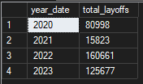
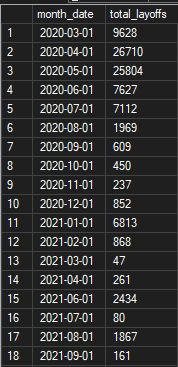
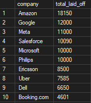
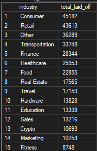
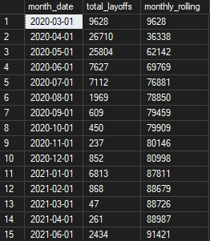

# SQL Layoffs Analysis Project
A SQL Server portfolio project focused on exploratory and business analysis of layoffs data. The project uses a cleaned dataset from the Silver layer to analyze trends over time, compare companies, industries, countries, and stages, and identify the biggest layoff events using aggregation and ranking techniques.

---

## ✨ Project Overview

This project demonstrates how to turn cleaned warehouse data into meaningful insights using SQL queries.
It includes:
1. Layoff trends over time
2. Company analysis
3. Industry analysis
4. Country analysis
5. Stage analysis
6. Percentage-based layoffs analysis
7. Rolling totals
8. Ranking analysis
9. Funding-related analysis

The goal of the project is to show a practical SQL analysis workflow that is easy to understand, easy to maintain, and suitable for a portfolio.

---

## 🧱 Data Foundation

This project is based on the cleaned dataset exported from the `silver.layoffs` table of the SQL data warehouse project.

### Main dataset used
- `dataset/layoffs_cleaned.csv`
The dataset contains cleaned and standardized layoff records with proper data types and business-ready values.

---

## 📂 Project Structure
```text
sql-layoffs-analysis/
├── dataset/
│   └── layoffs_cleaned.csv
│
├── docs/
│   └── images/
│       ├── monthly_layoffs.png
│       ├── rolling_total.png
│       ├── top_companies.png
│       ├── top_industries.png
│       └── yearly_layoffs.png
│ 
│
├── scripts/
│   ├── company_analysis.sql
│   ├── country_stage_analysis.sql
│   ├── industry_analysis.sql
│   ├── percentage_analysis.sql
│   ├── ranking_and_funding_analysis.sql
│   ├── rolling_total.sql
│   └── time_trends.sql
│
└── README.md
```

---

## 📈 Analysis Sections

### 1. Time Trends
This section analyzes layoffs over time.
- yearly layoffs
- monthly layoffs
- highest monthly layoffs
- rolling total of layoffs over time

### 2. Company Analysis
This section focuses on the companies most affected.
- top companies by total layoffs
- top companies within each year

### 3. Industry Analysis
This section compares layoffs across industries.
- top industries affected
- top industries within each year

### 4. Country and Stage Analysis
This section shows where layoffs happened most.
- top countries affected
- top company stages affected
- layoffs by country and industry

### 5. Percentage-Based Analysis
This section highlights companies with large workforce reductions.
- percentage laid off vs total laid off
- companies with 100% layoffs

### 6. Funding and Ranking Analysis
This section combines layoffs with funding and ranking logic.
- highly funded companies with major layoffs
- top 10 companies by layoffs
- top 10 industries by layoffs
- top 10 countries by layoffs

---

## 🛠️ Features

- SQL Server-based exploratory analysis
- Cleaned Silver-layer dataset
- Trend analysis over time
- Ranking and aggregation techniques
- Window functions and CTEs
- Business-focused insights
- Portfolio-friendly structure with clear comments and sections

---

## 📸 Visuals
  
### Yearly Layoffs
This screenshot shows the output of the yearly layoffs.



### Monthly Layoffs
This screenshot shows the output of the monthly layoffs.



### Top Companies
This screenshot shows the output of the top companies layoffs.



### Top Industries
This screenshot shows the output of the top industries layoffs.



### Rolling Total
This screenshot shows the output of the rolling total layoffs.



---

## 🧩 Prerequisites
- Microsoft SQL Server
- SQL Server Management Studio (SSMS) or Azure Data Studio
- Access to the cleaned dataset `layoffs_cleaned.csv`

---

## 🚀 How to Run
1. Open SQL Server Management Studio or Azure Data Studio.
2. Restore or attach the database used for the analysis, if needed.
3. Make sure `layoffs_cleaned.csv` is available in the `dataset/` folder.
4. Open the SQL scripts in the `scripts/` folder.
5. Run each script section by section.
6. Save the result screenshots into `docs/images/`.

---

## 📌 Important Note
This repository is focused on analysis only. The cleaning and ETL pipeline are handled in the separate SQL data warehouse project.

---

## 👨‍💻 Author
**Václav Benda**


